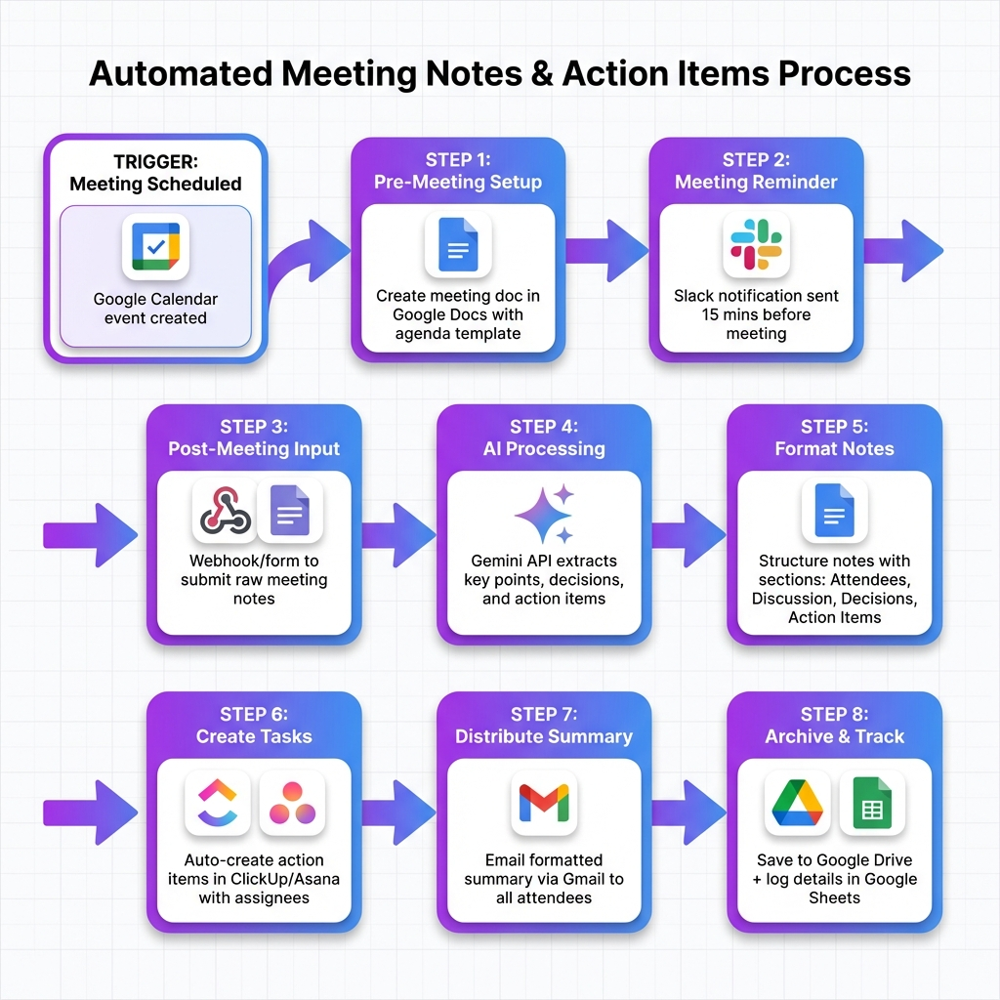

# Automated Meeting Notes & Action Items 🎙️

**Convert meeting recordings to notes and action items automatically**

[](https://n8n.io/)
[](https://github.com/RayeesYousufGenAi/meeting-notes-automation)

---

## 📋 Overview

Automatically transcribe meeting recordings, generate AI-powered summaries, extract action items, assign tasks to team members, and send follow-up emails—all without manual effort.

**Perfect for:** Project managers, coordinators, remote teams, operations managers, executives

---

## 📊 Workflow Diagram



---

## ✨ Key Features

- ✅ **Auto-Transcription** - Convert audio/video to text using AssemblyAI/Deepgram
- ✅ **AI Summarization** - Generate concise meeting summaries with Gemini
- ✅ **Action Item Extraction** - Automatically identify tasks and owners
- ✅ **Task Creation** - Auto-create tasks in ClickUp/Asana/JIRA
- ✅ **Follow-Up Emails** - Send meeting notes to all participants
- ✅ **Searchable Archive** - Store all notes in Google Drive/Notion
- ✅ **Multi-Language Support** - Transcribe meetings in 30+ languages

---

## 🛠️ Tech Stack

### Integrations (All Free Tier)
- **Transcription:** AssemblyAI (free tier), Deepgram (free tier), Whisper API
- **AI:** Gemini API (free), OpenRouter (free models), Hugging Face
- **Task Management:** ClickUp API, Asana API, JIRA API (all free tiers)
- **Email:** Gmail API (free), SendGrid
- **Storage:** Google Drive API (free), Notion API
- **Calendar:** Google Calendar API (free)

---

## 🎯 Use Cases

### 1. **Project Standup Meetings**
- Transcribe daily standup
- Extract blockers and action items
- Create tasks automatically
- Send summary to team

### 2. **Client Meetings**
- Record client calls
- Generate professional summary
- Extract deliverables and deadlines
- Send follow-up email to client

### 3. **Executive Meetings**
- Transcribe leadership meetings
- Create executive summary
- Extract strategic action items
- Distribute to stakeholders

---

## 🆓 Free API Alternatives

| Service | Free Tier | Use For |
|---------|-----------|---------|
| **AssemblyAI** | 5 hours/month free | Audio transcription |
| **Deepgram** | $200 credit | High-quality transcription |
| **Gemini API** | 60 req/min | Summarization |
| **OpenRouter** | Free models | Text processing |
| **Whisper API** | Open source | Local transcription |

---

## 📝 Workflow Steps

### 1. **Meeting Recording Upload**
- Upload from Zoom/Google Meet/Teams
- Or upload audio/video file manually
- Trigger workflow automatically

### 2. **Transcription**
- Send to AssemblyAI/Deepgram
- Get accurate text transcription
- Identify speakers automatically

### 3. **AI Processing**
- Generate meeting summary with Gemini
- Extract key discussion points
- Identify action items and owners
- Detect decisions made

### 4. **Task Creation**
- Parse action items
- Create tasks in ClickUp/Asana
- Assign to mentioned team members
- Set due dates from discussion

### 5. **Distribution**
- Send email with summary
- Share in Slack channel
- Save to Google Drive/Notion
- Update project documentation

---

## 🤖 AI-Generated Outputs

### Meeting Summary
- Executive summary (2-3 sentences)
- Key discussion points
- Decisions made
- Next steps

### Action Items
```
- [ ] @John: Update project timeline by Friday
- [ ] @Sarah: Send proposal to client by EOD
- [ ] @Team: Review design mockups before next meeting
```

### Meeting Metadata
- Date and time
- Participants
- Duration
- Topics discussed

---

## 📊 Information Extracted

### Automatically Detected
- Action items with owners
- Deadlines and due dates
- Decisions and approvals
- Questions raised
- Follow-up items
- Mentioned documents/links

---

## 📈 Benefits

- ⏱️ **Save 30+ min per meeting** on manual note-taking
- 🎯 **Never miss action items** - AI extracts everything
- 📧 **Instant follow-ups** - Automated email distribution
- 📚 **Searchable archive** - Find past discussions easily
- ✅ **Better accountability** - Clear task ownership
- 🌍 **Remote-friendly** - Perfect for distributed teams

---

## 🔍 Advanced Features

### Speaker Identification
- Detect who said what
- Track speaking time per person
- Identify key contributors

### Sentiment Analysis
- Detect meeting tone
- Identify concerns or blockers
- Flag contentious topics

### Integration with Calendar
- Auto-trigger for scheduled meetings
- Pull attendee list from calendar
- Link notes to calendar event

---

## 📧 Email Template Example

```
Subject: Meeting Notes - Project Sync (Feb 1, 2026)

Hi Team,

Here are the notes from today's meeting:

**Summary:**
We discussed Q1 roadmap priorities and decided to focus on feature X. 
Timeline approved with launch date of March 15.

**Action Items:**
• John - Update project timeline (Due: Feb 5)
• Sarah - Send proposal to client (Due: Feb 2)
• Team - Review design mockups (Due: Feb 3)

**Decisions:**
• Approved budget increase for Q1
• Selected vendor for infrastructure

Full transcript attached.

Best regards,
Automated Meeting Assistant
```

---

## 👤 Author

**Rayees Yousuf**
- GitHub: [@RayeesYousufGenAi](https://github.com/RayeesYousufGenAi)
- Email: rayeesyousuf80@gmail.com

---

**Made with ❤️ for productive teams and efficient meetings**
